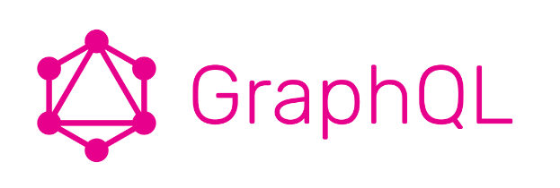
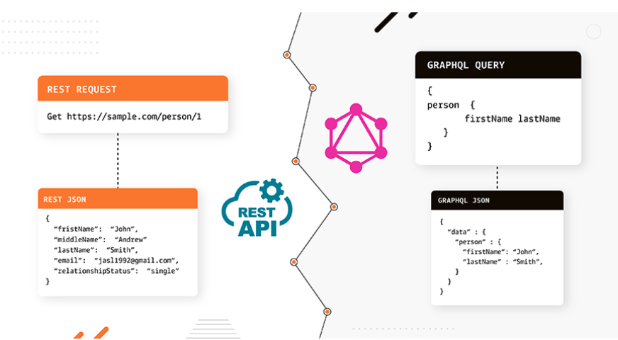
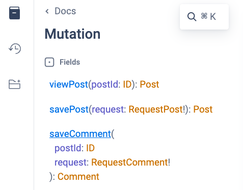
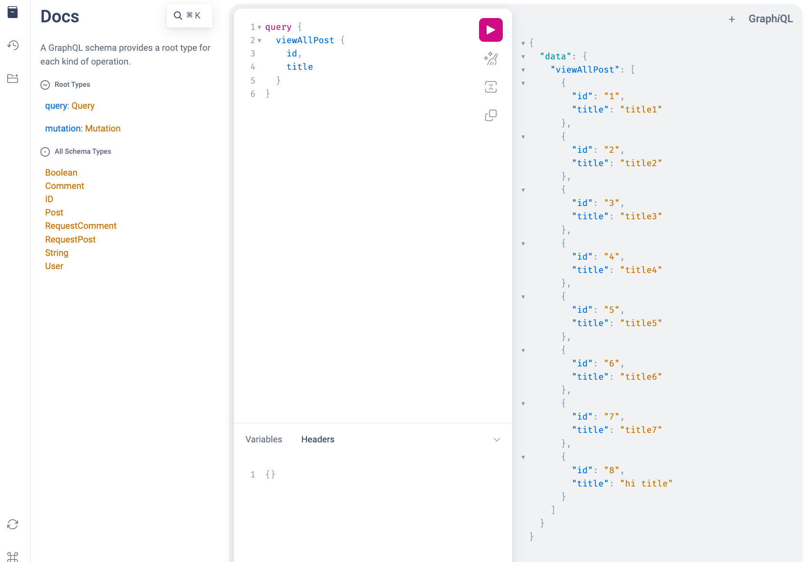
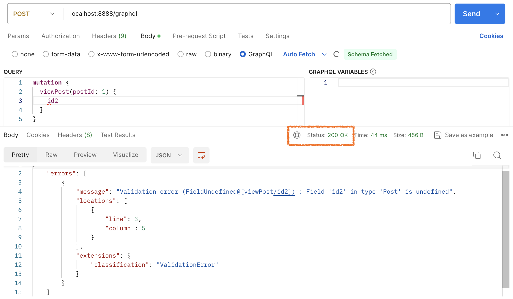

# springboot-graphql

REST API가 아닌 GraphQL을 이용하는 방식으로 구현한 실습용 서버입니다.

GraphQL이 처음이신 분들이라면, 전체를 읽어보시길 추천드립니다.

**REST API의 단점을 극복하고자 나온 만큼, 내용을 학습해보고 저의 개인적인 견해(챕터 8)와 비교해보시면 좋을 것 같습니다.**

## 목차

* [1. GraphQL 소개](#1-graphql-소개)
    + [1-1. GraphQL 이란?](#1-1-graphql-이란)
    + [1-2. GraphQL의 기본 개념 및 철학](#1-2-graphql의-기본-개념-및-철학)
    + [1-3. REST API 와의 비교](#1-3-rest-api-와의-비교)
* [2. GraphQL의 장점](#2-graphql의-장점)
    + [2-1. 데이터 오버패칭 및 언더패칭 문제 해결](#2-1-데이터-오버패칭-및-언더패칭-문제-해결)
* [3. GraphQL의 단점](#3-graphql의-단점)
    * [3-1. GraphQL 사용 시 파일 업로드 작업이 불편하다.](#3-1-graphql-사용-시-파일-업로드-작업이-불편하다)
    * [3-2. 문서화의 불편함](#3-2-문서화의-불편함)
    * [3-3. 클라이언트의 요청이 자유로워짐에 있어서 생기는 부작용](#3-3-클라이언트의-요청이-자유로워짐에-있어서-생기는-부작용)
* [4. 주요 개념과 특징](#4-주요-개념과-특징)
    + [4-1. Query & Mutation](#4-1-query--mutation)
    + [4-2. Schema & Type System](#4-2-schema--type-system)
    + [4-3. 구독으로 실시간 데이터 처리](#4-3-구독으로-실시간-데이터-처리)
    + [4-4. 하나의 엔드포인트](#4-4-하나의-엔드포인트)
* [6. Spring Boot with GraphQL](#6-spring-boot-with-graphql)
    + [6-1. GraphiQL로 결과 확인하기](#6-1-graphiql로-결과-확인하기)
    * [6-2. 실습용 쿼리 및 뮤테이션](#6-2-실습용-쿼리-및-뮤테이션)
* [8. GraphQL에 대한 개인적인 견해](#8-graphql에-대한-개인적인-견해)
    + [8-1. 클라이언트가 자유롭게 쿼리를 불러오도록 열어줌으로써 부작용이 발생](#8-1-클라이언트가-자유롭게-쿼리를-불러오도록-열어줌으로써-부작용이-발생할-수-있습니다)
    + [8-2. 마이크로 서비스(MSA)에서의 복잡성 증가](#8-2-마이크로-서비스msa에서의-복잡성-증가)
    + [8-3. 하나의 엔드포인트](#8-3-하나의-엔드포인트)
    + [8-4. HTTP 상태 코드의 모호함](#8-4-http-상태-코드의-모호함)
    + [8-5. 마이크로 서비스(MSA)에서의 복잡성 증가](#8)
* [9. 참고자료](#9-참고자료)

## 1. GraphQL 소개



### 1-1. GraphQL 이란?

> **GraphQL은 API를 위한 쿼리 언어이며 이미 존재하는 데이터로 쿼리를 수행하기 위한 런타임 입니다.**
>

GraphQL 은 2015년에 [오픈 소스](https://github.com/graphql/graphql-spec/releases/tag/July2015)로 공개되었습니다.

**기존의 API 접근 방식인 REST가 가지는 한계를 극복하기 위해 탄생**했으며,
**데이터 오버패칭과 여러 API 엔드포인트를 통한 복잡한 데이터 요청 과정을 단순화** 하려는 목표를 가지고 있습니다.

<br/>

### 1-2. GraphQL의 기본 개념 및 철학

- GraphQL 의 핵심 철학은 클라이언트가 서버로부터 필요한 데이터를 정확히, **필요한 만큼만 요청**할 수 있게 하는데에 있습니다.
- 서버는 클라이언트가 GraphQL 로 요청할 수 있는 데이터 타입과 각 타입에 대해 요청할 수 있는 필드들을 정의해 타입 시스템을 구축합니다.
- 각 타입의 필드에 대한 요청을 해석 및 처리하는 로직(Ex. DB에 접근)은 Resolver 함수로 구현합니다.

<br/>

### 1-3. REST API 와의 비교




> **REST API 는 리소스 기반의 아키텍처입니다.**
>

- 각 리소스(URL 엔드포인트) 에 대해 HTTP 메서드를 이용해 CRUD 작업을 수행하고, 각 리소스에 접근하기 위해서는 그에 맞는 URL 엔드포인트를 사용해야 합니다.
- 이렇게 하면 API 의 구조를 명확하게 하고 문서화가 용이해 사용하기 쉽습니다.
- 하지만 REST API 방식은 데이터 요구가 복잡해질 경우 여러 엔드포인트를 사용해 데이터를 집계해야하고, 불필요한 데이터를 패칭하는 일이 생길 수 있습니다.

<br/>

> **반면 GraphQL은 단일 엔드포인트를 통해 클라이언트가 필요한 데이터의 형태로 요청할 수 있습니다.**
>

<br/>

## 2. GraphQL의 장점

### 2-1. 데이터 오버패칭 및 언더패칭 문제 해결

- 오버패칭 : 클라이언트가 필요로 하는 데이터보다 더 많은 데이터를 요청하는 것
- 언더패칭 : 클라이언트가 필요로 하는 데이터보다 더 적은 데이터를 요청하는 것

<br/>

## 3. GraphQL의 단점

### 3-1. GraphQL 사용 시 파일 업로드 작업이 불편하다.

- GraphQL에서는 사진을 업로드하기 위해서는 바이트 배열로 전달해야 한다.
- 결국 GraphQL을 REST API와 함께 사용할 수도 있다고는 하지만, 불편하다.

    ```graphql
    type Mutation {
        # 이미지 업로드를 위한 뮤테이션
        uploadImage(file: UploadInput!): String!
    }
    
    input UploadInput {
        fileName: String!
        contentType: String!
        data: String!   # 바이트 배열을 전달
    }
    ```

### 3-2. 문서화의 불편함

- 비즈니스 로직을 작성하고나서, `schema.graphqls` 파일에 반드시 타입과 쿼리를 작성해야 한다.
    - 이때 직접 타이핑을 하는 방식이기 때문에, 실수를 불러일으키기 쉽다.
    - ex. 위에 나온 Mutation에 선언한 uploadImage라는 메서드명에서 오타가 발생할 경우, 서버에서 구현한 리졸버의 메서드명과 달라 호출이 되지 않는다. → null 을 리턴.. 따라서
      디버깅하기 힘듬.
- 또한 모든 엔티티를 타입으로 정의하기에는 양이 너무 많아 무리가 있다.
- GraphQL에서 공식적으로 지원하는 API 문서화 방식은 GraphiQL에서 지원하는 Docs 기능이다.
    - 다만, 이는 직접 클릭을 해서 들어가야 보이며, 추가적인 코멘트를 작성할 수는 없다.

      

### 3-3. 클라이언트의 요청이 자유로워짐에 있어서 생기는 부작용

- 클라이언트가 자유롭게 쿼리를 불러오도록 열어줌으로써 부작용이 발생할 수 있습니다.
    - 클라이언트가 요청을 불필요하게 무거운 쿼리를 보냄으로써 서버에 부담이 가해질 수 있습니다.

<br/>

## 4. 주요 개념과 특징

### 4-1. Query & Mutation

- **Query** : 데이터를 읽기 위한 요청입니다.
    - GraphQL 을 사용하면 클라이언트는 서버에게 필요한 데이터의 구조를 명시적으로 요청하며, 서버는 해당 구조에 맞게 데이터를 응답합니다.
    - HTTP 메서드 중 GET에 해당합니다.
- **Mutation** : 데이터를 생성, 수정, 삭제하기 위한 요청입니다.
    - 쿼리와 유사한 문법을 사용하지만, 서버의 데이터를 변형시킬 때 사용됩니다.
    - HTTP 메서드 중 POST, PUT, PATCH, DELETE 메서드에 해당합니다.

### 4-2. Schema & Type System

- Schema
    - GraphQL에서 사용할 수 있는 **데이터의 종류와 그 관계를 정의하는 문서**입니다.
    - 스키마는 서버에서 지원하는 쿼리, 뮤테이션, 객체 타입등을 명시합니다.
    - Spring Boot의 경우, `resources/graphql/schema.graphqls` 로 작성하곤 합니다.
- Type System
    - GraphQL 은 강력한 타입 시스템을 사용해 API 를 주고받을 데이터 형태를 정의합니다.
    - 이 시스템은 API를 더 안정적으로 만들고, 클라이언트와 서버간의 명확한 약속을 가능하게 합니다.
- Spring Boot의 경우, 아래와 같이 스키마 파일 안에 타입을 명시할 수 있습니다.
    - 이때, `viewAllPost` 와 같은 명칭은 리졸버의 메서드명과 반드시 동일해야 합니다.
    - 일치하지 않을 경우 에러가 발생하지는 않지만, 리졸버를 호출하지 못해 null을 반환합니다.
  ```graphql
  # schema.graphqls
  ### Query 정의 (GET 역할)
  type Query {
    viewAllPost: [Post]
    getCommentsByPostId(postId: ID): [Comment]
  }
  
  ### Mutation 정의 (POST, PUT, PATCH, DELETE 역할)
  type Mutation {
    viewPost(postId: ID): Post
    savePost(request: RequestPost!): Post
    saveComment(postId: ID, request: RequestComment!): Comment
  }
  
  type Post {
    id: ID
    title: String
    content: String
    views: String
    author: User
    comments: [Comment]
  }
  ```

### 4-3. 구독으로 실시간 데이터 처리

- 구독 : 실시간으로 데이터를 받기 위한 메커니즘 입니다.
    - query와 mutation과 마찬가지로 마지막 operation type입니다.
    - GraphQL Subscription은 WebSocket을 기반으로 구현되어, 서버가 구독중인 클라이언트와 지속적인 연결을 유지
- 실시간 채팅, 알림 시스템 등 실시간 데이터 업데이트가 필요한 애플리케이션을 구현하기 용이합니다.

### 4-4. 하나의 엔드포인트

- GraphQL은 모든 쿼리와 뮤테이션, 구독 요청을 단일 엔드포인트를 통해 처리합니다.
- 이 접근 방식은 API의 구조를 단순화하며, 클라이언트가 여러 엔드포인트를 관리하는 복잡성을 줄여줍니다.

<br/>

## 6. Spring Boot with GraphQL

### 6-1. GraphiQL로 결과 확인하기

GraphQL은 쿼리를 확인할 수 있도록 GraphiQL이라는 GUI를 제공한다.

- [http://54.180.90.48:8888/graphiql](http://54.180.90.48:8888/graphiql?path=/graphql)
- Spring Boot의 경우, application.yml에 아래와 같이 작성할 경우 GraphiQL을 활성화시킬 수 있다.

    ```yaml
    spring:
      graphql:
        graphiql:
          enabled: true   # default : false
          path: /graphiql # default : /graphiql
    ```

  

### 6-2. 실습용 쿼리 및 뮤테이션

- 전체 게시글 조회 : query

    ```graphql
    query {
      viewAllPost {
        id
        title
        content
        author {
          id
          name
        }
      }
    }
    ```

- 특정 게시글 조회 : mutation

    ```graphql
    mutation {
      viewPost(postId: 1) {
        id
        title
        content
        author {
          id
          name
        }
        comments {
          id
          content
          writer {
            id
            name
          }
        }
      }
    }
    ```

- 게시글 작성 : mutation

    ```graphql
    mutation {
      savePost(request: {title: "hi title", content: "hi content"}) {
        title
        content
      }
    }
    ```

- 댓글 저장 : mutation

    ```graphql
    mutation {
      saveComment(postId: 1, request: {content: "hi content"}) {
        id
        content
      }
    }
    ```

- 특정 게시글의 댓글 목록 : query

    ```graphql
    query {
      getCommentsByPostId(postId: 1) {
        id
        content
        writer {
          id
          name
        }
      }
    }
    ```

<br/>

## 8. GraphQL에 대한 개인적인 견해

결론적으로 아래와 같은 이유로 GraphQL이 REST API를 대체하기에는 무리가 있다고 생각이 듭니다.

### 8-1. 클라이언트가 자유롭게 쿼리를 불러오도록 열어줌으로써 부작용이 발생

- 클라이언트가 요청을 불필요하게 무거운 쿼리를 보냄으로써 서버에 부담이 가해질 수 있습니다.

### 8-2. 마이크로 서비스(MSA)에서의 복잡성 증가

- 백엔드 서버가 MSA인 경우 클라이언트에서 각 서비스에 API 요청을 각각 보내야 해서 또다시 언더페칭이 발생합니다.
- 언더페칭을 해결하기 위해 복잡성을 감수하며 GraphQL을 채택했는데, 다시 언더페칭이 발생한다면 결국 복잡하다는 단점만 남게 된다고 생각합니다.

### 8-3. 하나의 엔드포인트

- 기능별로 지연시간(letency)나 에러율 등을 모니터링하기 어려울 수 있습니다.

### 8-4. HTTP 상태 코드의 모호함

- express-graphql에서는 요청한 데이터가 없는 경우 상태코드 500을 반환합니다.
- Apollo
  Server는 [순 에러인 경우에도 200을 반환](https://www.apollographql.com/docs/apollo-server/data/errors/#setting-http-status-code-and-headers)
  합니다.
- spring-graphql에서도 에러가 발생시, 상태 코드가 200으로 반환됩니다.
  

<br/>

## 9. 참고자료

- [GraphQL의 Schema 타입](https://graphql-kr.github.io/learn/schema/#)
- [카카오 테크 : GraphQL 개념 잡기](https://tech.kakao.com/2019/08/01/graphql-basic/)
- [다나와 기술 블로그 : Spring for GraphQL](https://danawalab.github.io/spring/2022/06/06/Spring-for-GraphQL.html)
- [Bealdung : Introduction to GraphQL](https://www.baeldung.com/graphql)
- [Spring Doc : Spring for GraphQL](https://docs.spring.io/spring-graphql/docs/1.0.6/reference/html/)
- [요즘 IT : 개발자에게 편리함을 주는 ‘GraphQL’ 도입 시 주의할 점은?](https://yozm.wishket.com/magazine/detail/2113/)